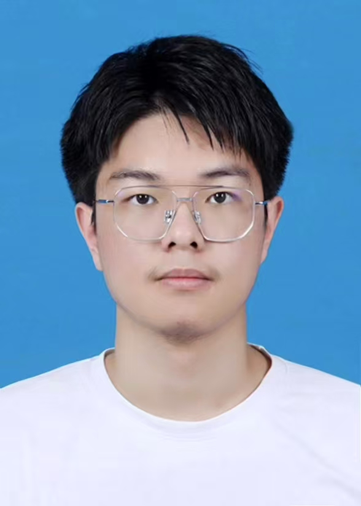

<!DOCTYPE html>
<html lang="en">
<head>
    <meta charset="UTF-8">
    <meta name="viewport" content="width=device-width, initial-scale=1.0">
    <title>Baiming Zhang's GitHub Desktop</title>
    
</head>
<body>
    <header>
        

            <h1>🚀 Welcome to Baiming Zhang's Homepage!</h1>
        

    </header>
    <nav>
        

            <a href="#home">Home</a>
            <a href="#Publications">Publications</a>
            <a href="#academic">Academic Experience</a>
            <a href="#awards">Awards & Honors</a>
            <a href="#boasts">Boasts</a>
            <a href="#contact">Contact</a>
        

    </nav>
    

        

            
            <h2>Baiming Zhang</h2>
            
I'm a 🎓 junior undergraduate majoring in Engineering Mechanics at School of Aeronautics and Astronautics. 
            
I'm studying in Zhejiang University (ZJU) 🚀 (Chu Kochen Honors College) with a GPA of 3.93/4.0 up to June 29, 2025.

            
I'm currently conducting research in 🔬 Quantum Computational Fluid Dynamics.

        

        

            <h2>📰 Publications</h2>
            
At present, I have not yet published any papers. However, I am actively working on drafting the primary authorship of one paper, while also conceptualizing another that will also carry my primary authorship.

            <ul>
                <li><strong>1 Drafting:</strong> Working on a paper as the primary author.</li>
                <li><strong>1 Conceptualizing:</strong> Developing ideas for another paper with primary authorship.</li>
            </ul>
            
I am excited about these projects and look forward to sharing more updates in the future.

        

        

            <h2>📚 Academic and Research Experience</h2>
            

                <h3>1. ⚛️ Quantum States and Devices Research</h3>
                <ul>
                    <li>
                        🌟 October 2023 - June 2024:  
                        Under the guidance of Professor Dawei Wang, Dr. Xingqi Xu and Dr. Jiefei Wang, I engaged in quantum optics research focusing on Rydberg atoms and topological insulators.
                    </li>
                    <li>
                        🧲 June 2024 - December 2024:  
                        I explored magnetic field precision measurement and transitioned into studying Fock states and the 4D Quantum Hall Effect.
                    </li>
                </ul>
            

            

                <h3>2. 🌊 Fluid Mechanics and Quantum Computing</h3>
                <ul>
                    <li>
                        
   📚 January 2025 - April 2025: 
                        Under Professor Shiying Xiong's mentorship, I shifted my focus to fluid dynamics and quantum computing within my major. I also contributed to book writing related to my advisor's research.

                    </li>
                </ul>
            

            

                <h3>3. 🧠 Machine Learning and Quantum Hamilton Neural Networks (QHNN)</h3>
                <ul>
                    <li>
                           🤖 April 2025 - June 2025:  
                        I delved into neural networks, including Physics-Informed Neural Networks (PINN), Hamilton Neural Networks (HNN), and smaller networks like Taylor-Net.
                    </li>
                    <li>
                           💡 June 2025 - Present:  
                        Leveraging my quantum computing background and neural network expertise, I've been developing an original project called Quantum Hamiltonian Neural Networks (QHNN).
                    </li>
                </ul>
            

        

        

            <h2>🏅 Awards and Honors</h2>
            <ol>
                <li>
                    🥇 International College Student Engineering Mechanics Competition  
                    <strong>World Gold Medal (Top 0.1%)</strong>
                </li>
                <li>
                    🏆 Chinese National College Student Zhou Peiyuan Mechanics Competition  
                    <strong>First Prize (Top 1%)</strong>
                </li>
                <li>
                    📜 Government Scholarship  
                    <strong>(Top 10%)</strong>
                </li>
            </ol>
        

        

            <h2>😊 Boasts</h2>
            <ol>
                <li>
                    🎉 Featured on Zhejiang University's School of Aeronautics and Astronautics official website as the first student in our school's history to win the <strong>World Champion Gold Medal</strong> at the International College Student Engineering Mechanics Competition.
                </li>
                <li>
                    💡 Pursuing a breakthrough in cutting-edge quantum neural networks! If you share this interest, I'd be delighted to connect with you. Feel free to reach out via email with any suggestions or inquiries.
                </li>
            </ol>
        

    

    <footer id="contact">
        

            
© 2025 Baiming Zhang. All rights reserved.

            
Contact with me: <a href="mailto:baimingzhang@zju.edu.cn">baimingzhang@zju.edu.cn</a> | <a href="https://github.com/baiming-zhang">GitHub</a>

        

    </footer>
</body>
</html>